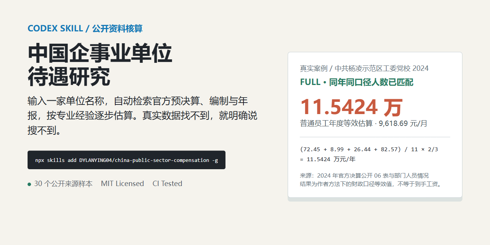

# China Enterprise and Public-Institution Compensation Research

[](https://github.com/DYLANYING04/china-public-sector-compensation/actions/workflows/tests.yml)
[](LICENSE)
[](https://skills.sh/DYLANYING04/china-public-sector-compensation)

[中文说明](README.md)

> Enter a Chinese enterprise or public institution name. The skill searches official reports and estimates compensation with a professional method; when the real data is unavailable, it plainly says `搜不到`.



## Install in One Command

```bash
npx skills add DYLANYING04/china-public-sector-compensation -g
```

`-g` installs the skill globally. The installer discovers the root `SKILL.md`; the dynamic install count is shown by the skills.sh badge above. Manual cloning is the fallback:

```powershell
git clone https://github.com/DYLANYING04/china-public-sector-compensation.git "$env:USERPROFILE\.codex\skills\china-public-sector-compensation"
```

Run `git pull` in that directory to update an existing installation. Availability for skill-folder uploads can differ by product and workspace.

## See It Work

You do not need links, spreadsheets, JSON, or a calculation-route decision. Send one sentence:

```text
Research the compensation of [full institution name] using $china-public-sector-compensation.
```

The skill identifies the entity, searches official sources, reads attachments, reconciles scope, and calculates. Without a supplied year, it uses the latest completed fiscal year that can be verified. It only asks a question when the name truly identifies multiple entities.

The result starts with the institution/year, evidence state, and conclusion or missing input. Source ledger and arithmetic follow for review.

## Reproducible Cases

- [Yangling Party School 2024](cases/yangling-party-school-2024.md): `FULL`; same-year staff and wage rows match, with an ordinary-employee annual equivalent of `11.5424 万元`.
- [Beijing Investment Promotion Service Center (unit-level) 2022](cases/beijing-investment-center-2022.md): `FULL`; reproduces the article's `503 + 1764`, 88-person denominator, and separately judged `196` award, yielding `17.1823 万元` for the ordinary-employee annual equivalent.
- [Nanjing Youan Hospital 2024](cases/nanjing-youan-hospital-2024.md): `STRUCTURE_ONLY`; demonstrates why a blank bonus cell and unmatched headcount must not be forced into a result.
- [Mohe Media Center 2024](cases/mohe-media-center-2024.md): a remote county portal, a `1.1861` structure multiple, and a scope-safe refusal to divide by an old denominator.
- [Beijing Investment Promotion Service Center 2024](cases/beijing-investment-center-2024.md): a later-year boundary case showing why a unit final account must not be divided by department-wide staff when the matching unit headcount is not retained.

The launch [benchmark of 30 public-source inputs](benchmark/README.md) found usable wage breakdowns for `28/30`, but only `1/30` met the strict per-person `FULL` standard. That conservatism is intentional: `STRUCTURE_ONLY` or `搜不到` is preferable to a cross-scope quotient.

## What It Does

- Searches city fiscal indexes, supervising-department batch pages, unit disclosure columns, and government attachment storage.
- Covers municipalities, provincial capitals, prefecture-level cities, county-level cities, development zones, demonstration zones, and central vertical systems.
- Handles PDFs, XLSX files, ZIP archives, scanned documents, failed previews, JavaScript finance portals, and official object-storage links.
- Searches wage amounts and headcount evidence in parallel, checking entity, year, budget/final-account basis, personnel scope, and amount unit.
- Clearly reports `搜不到` when required real data cannot be found. It does not fill gaps with industry averages, while allowing explicitly labeled expert judgments about the purpose of a real disclosed amount under the author's method.

## Expert Calculation Method

These rules are mandatory, not optional reference points. The route labels describe analytical methods, not official institutional classifications:

1. **Local public institutions**

   `Comparable wage total / matched headcount = organization average`

   Ordinary employee estimate: `organization average x 2/3`.

2. **Units meeting the author's leadership-skew/enterprise-style condition**

   `Total wage amount / matched employee count = organization average`

   Ordinary employee estimate: `organization average x 1/2`.

3. **Mixed-staff, operating-income, or denominator-incompatible institutions**

   `(Bonus + performance pay + allowances) / basic wage`

   - `>= 4`:待遇不错 (good compensation)
   - `< 3`:待遇较差 (poor compensation)
   - `3 to < 4`: intermediate; continue with housing-fund and occupational-annuity ratios

4. **Institutions with sourced class-I status and compatible staff scope**

   When the wage total and personnel scope match, calculate the per-person amount directly and state whether the denominator is year-end staff, annual average staff, or another basis.

**Author's special-award judgment:** The reported amount must remain real and traceable, but a report need not name the award's purpose. As in the author's assessment that `196` is likely a recruitment-investment task award, the analyst may make an expert inference from the unit's duties and the report structure. The report must label it as an expert judgment, give its basis and confidence, and never present it as source wording.

All calculator amount fields are normalized to ten-thousand yuan (`万元`). The original unit, conversion, and source location must be recorded.

The report must state `official institution identity` and `expert analysis route` separately. If no current establishment approval, registration report, `三定` provision, or equivalent official source is available, it reports the identity as unknown instead of inferring class I, class II, or civil-service-reference status from the name or wage structure.

## Evidence States

Evidence states are separate from the expert route letters:

| State | Meaning |
|---|---|
| `FULL` | Same-year, same-scope final-account wage data and headcount are available; calculate per-person and ordinary-employee estimates |
| `STRUCTURE_ONLY` | Final-account wage structure is available but matched headcount is not; provide the structure judgment and continue the headcount search |
| `BUDGET_ONLY` | Only budget data is available; label the result as a budget estimate |
| `NO_USABLE_DATA` | No usable wage breakdown remains after the search checklist; explicitly report `搜不到` |

## Scope Rules

- Never divide a department-wide consolidated amount by the headcount of one subordinate unit.
- Never divide a new-year consolidated amount by an older center-only headcount.
- Never mix a budget, adjusted budget, and final account in one calculation.
- Never treat establishment count, actual staff, year-end staff, and annual-average staff as interchangeable denominators.
- Never describe a general-public-budget appropriation table as the institution's complete payroll; this is especially important for universities and hospitals with operating or service income.
- Never describe wage-welfare expenditure that includes employer contributions as after-tax or take-home salary.
- Never silently turn a blank cell into zero. A special award may be classified through the author's expert judgment, but the report must state the basis, confidence, and that the source did not explicitly name the award.
- Never treat a search-result title, reposted table, or failed attachment preview as final evidence.
- A landing page that identifies an attachment is not enough; inspect the attachment contents before accepting its figures.

You do not need to decide whether the result is “搜不到” or “待遇较差”. `搜不到` means the required real data was not found; “poor compensation” means the data was found and the result fell below the author's threshold.

## Research Workflow

1. Resolve the official name, aliases, region, supervising department, and sourced institutional identity; keep identity separate from the calculation route.
2. Search the city index, supervising-department batch page, unit disclosure column, finance platform, and attachment links.
3. Run identity, amount, and headcount tracks in parallel, prioritizing the same-year `公开06表` or equivalent wage-detail table.
4. Build an evidence ledger with title, direct URL, publisher, year, table/page location, original labels, amount unit, funding scope, and personnel scope.
5. Apply the expert formula step by step, separating one-off awards, special funds, and other non-comparable items.
6. Cross-check adjacent years, performance reports, staffing explanations, and recruitment notices.
7. Report the conclusion, arithmetic, sources, search log, and missing fields using [references/output-template.md](references/output-template.md).

Detailed guidance:

- [SKILL.md](SKILL.md): invocation entry point and overall workflow
- [references/expert-method.md](references/expert-method.md): four calculation routes and input schema
- [references/institution-classification.md](references/institution-classification.md): separation of official identity from analytical route
- [references/source-playbook.md](references/source-playbook.md): source order, query families, and attachment handling
- [references/city-coverage-patterns.md](references/city-coverage-patterns.md): tested portal patterns across ordinary and edge-case cities
- [references/output-template.md](references/output-template.md): standard report structure

## Calculator

For verified JSON inputs, run:

```bash
python scripts/calculate_compensation.py path/to/input.json
```

The calculator checks:

- report year and budget/final-account basis;
- original amount unit, normalized unit, and conversion note;
- source title, publisher, URL, location, and entity scope;
- explicit reconciliation of amount and headcount scope;
- same-year, same-scope headcount evidence for headcount routes.
- institutional identity note, funding scope, employer-contribution treatment, and denominator basis;
- ISO source dates and the reconciliation note between `301xx` rows and the `301` total.

If these fields are missing, the program refuses to calculate instead of silently producing a precise-looking number. See [references/expert-method.md](references/expert-method.md) for JSON examples.

## Tests

Run the repository tests:

```powershell
$env:PYTHONUTF8='1'
python -m unittest discover -s tests -v
```

GitHub Actions runs the suite on every push and pull request. The tests cover the screenshot's `2/3`, `1/2`, and structure thresholds, real public reports from Beijing, Shanghai, Shenzhen, Guangzhou, Wuhan, Hangzhou, Xi'an, Hefei, Yantai, Zibo, Shaanxi, and Mohe, and provenance rejection cases.

## Verified Search Lessons

- City fiscal indexes are effective for discovering many units; supervising-department pages are especially useful for museums, libraries, schools, and service centers.
- County and remote-area reports often consolidate a local center with transmitters or secondary budget units; read `部门决算编制范围` before selecting a denominator.
- Development zones and demonstration zones may use independent government-disclosure indexes with separate PDF and XLSX attachments.
- A JavaScript-only provincial finance portal is an access barrier, not proof that data is unavailable.
- Central vertical systems often list units on a bureau-wide batch page; after a 502 or timeout on a subsite, continue through direct attachments, archive pages, and adjacent years.
- Official object-storage links should be preserved together with the official landing page, not cited as bare file URLs.

## License and Contributions

This project is available under the [MIT License](LICENSE). To add a case, rule, or regional portal pattern, read [CONTRIBUTING.md](CONTRIBUTING.md), then use the [institution request](https://github.com/DYLANYING04/china-public-sector-compensation/issues/new?template=request-institution.yml), [data correction](https://github.com/DYLANYING04/china-public-sector-compensation/issues/new?template=data-correction.yml), or [portal-pattern](https://github.com/DYLANYING04/china-public-sector-compensation/issues/new?template=portal-pattern.yml) form.
