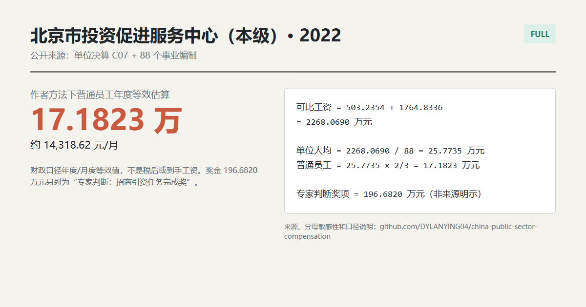

# 北京市投资促进服务中心（本级）2022

**Quick result:** `FULL`. This is the article's matching Beijing example, not the later 2024 page. The official 2022 unit report gives **事业编制 88 人、实际 87 人**; its attached `C07` wage-benefit table gives **基本工资 503.2354 万元、津贴补贴 1764.8336 万元、奖金 196.6820 万元**.



## Scope and route

The official report is explicitly for **北京市投资促进服务中心（本级）**, and the personnel section says the unit has 88 established posts and 87 actual staff. The article's screenshot uses the 88-person establishment denominator, so the main calculation preserves that author口径. The 87-person actual-staff result is shown as a sensitivity check rather than silently substituted.

Sources:

- [2022 unit final-account landing page](https://invest.beijing.gov.cn/zwgk/zfxxgk/zfxxgkpt/fdzdgknr/ysjs/202309/t20230911_3256142.html), unit identity and personnel section: “事业编制88人，实际87人”.
- [2022 unit final-account workbook](https://invest.beijing.gov.cn/zwgk/zfxxgk/zfxxgkpt/fdzdgknr/ysjs/202309/P020230911528543156945.xls), `C07 一般公共预算财政拨款基本支出决算表`, 工资福利支出 rows.

## Calculation using the author's route

```text
可比工资项目 = 503.2354 + 1764.8336 = 2268.0690 万元
单位人均 = 2268.0690 / 88 = 25.7735 万元/人/年
普通员工估算 = 25.7735 × 2/3 = 17.1823 万元/年
月度等效 = 17.1823 × 10,000 / 12 = 14,318.62 元/月
```

The article's rounded presentation (`503 + 1764`) gives `17.1742 万元/年`, or `14,311.87 元/月`; the result above keeps the official four-decimal figures.

## The `196` expert judgment

The `C07` table reports **奖金 196.6820 万元**. Following the article's professional judgment, this is separately labelled **专家判断：招商引资任务完成奖** because the unit's official duties are centered on investment promotion and the amount appears as a distinct bonus line. The report does **not** name it that way, so this is not source wording.

```text
专家判断奖项总额 = 196.6820 万元
按88人折算的人均专项奖 = 196.6820 / 88 = 2.2350 万元/人
```

If the 87 actual-staff denominator is preferred for a different personnel question, the recurring ordinary-employee equivalent is `17.3798 万元/年`, or `14,483.20 元/月`. That is a sensitivity result, not the article's main 88-person calculation.

This is an author-method fiscal compensation equivalent, not take-home pay. Employer-paid items and the exact cash distribution of the bonus are not inferred as personal cash salary.
