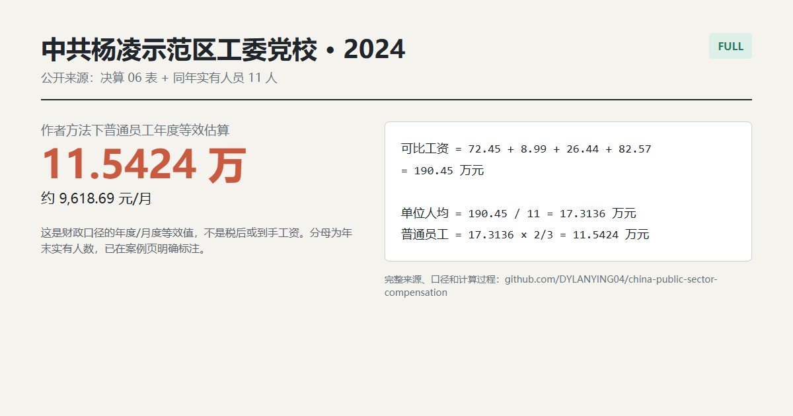

# 中共杨凌示范区工委党校 2024

**Quick result:** `FULL`. Under the author's local-unit `2/3` route, the ordinary-employee annual equivalent is **11.5424 万元**, or **9,618.69 元/月**. This is a fiscal compensation equivalent, not take-home pay.



## Why This Is Full

The [official Yangling landing page](https://yangling.gov.cn/zwgk/fdzdgknr/czjs/gwhbmjs/2024n/yjbmjs/2003764250585268226.html) links to the 2024 PDF and workbook. The report identifies the same first-level budget unit, states year-end actual staff of 11, and gives the 2024 `公开06表` wage rows in 万元.

| Input | Value | Source location |
|---|---:|---|
| 基本工资 | 72.45 万元 | 公开06表 |
| 津贴补贴 | 8.99 万元 | 公开06表 |
| 奖金 | 26.44 万元 | 公开06表 |
| 绩效工资 | 82.57 万元 | 公开06表 |
| 年末实有人员 | 11 人 | 部门人员情况 |

## Calculation

```text
可比工资项目 = 72.45 + 8.99 + 26.44 + 82.57 = 190.45 万元
单位人均 = 190.45 / 11 = 17.3136 万元/人/年
普通员工估算 = 17.3136 x 2/3 = 11.5424 万元/年
月度等效 = 11.5424 x 10,000 / 12 = 9,618.69 元/月
```

## Scope Notes

The denominator is a year-end actual headcount, not an annual average. The report's `工资福利支出` also includes employer-paid items; the calculation above deliberately uses the four comparable salary rows specified by the author's method. It is therefore an author-method equivalent, not cash salary or tax-adjusted pay.
